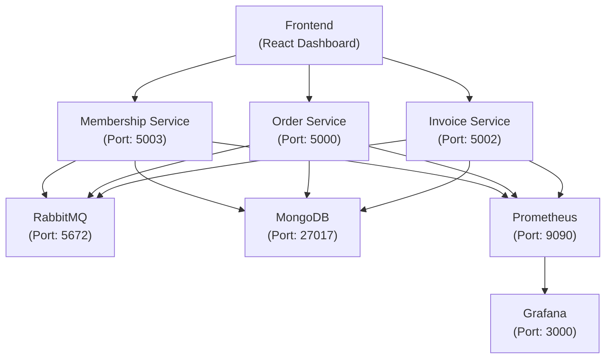

# Microservices Dashboard Project

Bu proje, mikroservis mimarisini kullanan bir e-ticaret sisteminin yönetim panelini içerir. Sistem, üyelik yönetimi, sipariş işleme ve fatura oluşturma gibi temel e-ticaret işlevlerini sağlar.

## Sistem Mimarisi



## Teknolojiler

### Backend Servisleri
- **.NET 6.0** - Mikroservislerin geliştirilmesi için
- **MongoDB** - Veritabanı
- **RabbitMQ** - Mesajlaşma ve event-driven mimari için
- **Docker** - Konteynerizasyon
- **Prometheus & Grafana** - Monitoring ve metrik toplama

### Frontend
- **React** - UI geliştirme
- **TypeScript** - Tip güvenliği
- **Nginx** - Web sunucusu
- **Docker** - Konteynerizasyon

## Servisler

### MembershipService (Port: 5003)
Üye yönetimi ve kimlik doğrulama işlemlerini yönetir.
- Üye kaydı
- Üye listesi
- Üye durumu takibi

### OrderService (Port: 5000)
Sipariş işlemlerini yönetir.
- Sipariş oluşturma
- Sipariş listesi
- Sipariş durumu güncelleme

### InvoiceService (Port: 5002)
Fatura işlemlerini yönetir.
- Fatura oluşturma
- Fatura listesi
- Fatura detayları

### Frontend Service (Port: 3001)
Kullanıcı arayüzü ve yönetim paneli.
- Modern ve responsive tasarım
- Real-time güncelleme
- Kolay kullanılabilir arayüz

## Kurulum

### Ön Gereksinimler
- Docker ve Docker Compose
- .NET 6.0 SDK (geliştirme için)
- Node.js ve npm (geliştirme için)

### Docker ile Kurulum
1. Projeyi klonlayın:
   ```bash
   git clone <repo-url>
   cd <proje-klasörü>
   ```

2. Docker Compose ile servisleri başlatın:
   ```bash
   docker-compose up -d
   ```

3. Servislere erişim:
   - Frontend: http://localhost:3001
   - MembershipService: http://localhost:5003
   - OrderService: http://localhost:5000
   - InvoiceService: http://localhost:5002
   - RabbitMQ Management: http://localhost:15672
   - Grafana: http://localhost:3000
   - Prometheus: http://localhost:9090

### Geliştirme Ortamı Kurulumu
1. Backend servisleri için:
   ```bash
   cd <servis-klasörü>
   dotnet restore
   dotnet run
   ```

2. Frontend için:
   ```bash
   cd microservices-dashboard
   npm install
   npm start
   ```

## Mimari

### Mikroservis Mimarisi
- Bağımsız ve ölçeklenebilir servisler
- Event-driven iletişim (RabbitMQ)
- Servis keşfi ve yük dengeleme
- Distributed tracing ve logging

### Veri Akışı
1. Frontend -> Backend servisleri (HTTP/REST)
2. Servisler arası iletişim (RabbitMQ)
3. Veri depolama (MongoDB)
4. Metrik toplama (Prometheus)
5. Görselleştirme (Grafana)

## Monitoring ve Logging

### Prometheus Metrikleri
- Servis sağlık durumu
- İstek sayısı ve yanıt süreleri
- Sistem kaynakları kullanımı

### Grafana Dashboards
- Servis performans metrikleri
- Sistem durumu görselleştirme
- Alarm ve bildirim yapılandırması

## Katkıda Bulunma
1. Fork yapın
2. Feature branch oluşturun
3. Değişikliklerinizi commit edin
4. Branch'inizi push edin
5. Pull request açın

## Lisans
Bu proje MIT lisansı altında lisanslanmıştır. Detaylar için [LICENSE](LICENSE) dosyasına bakın. 